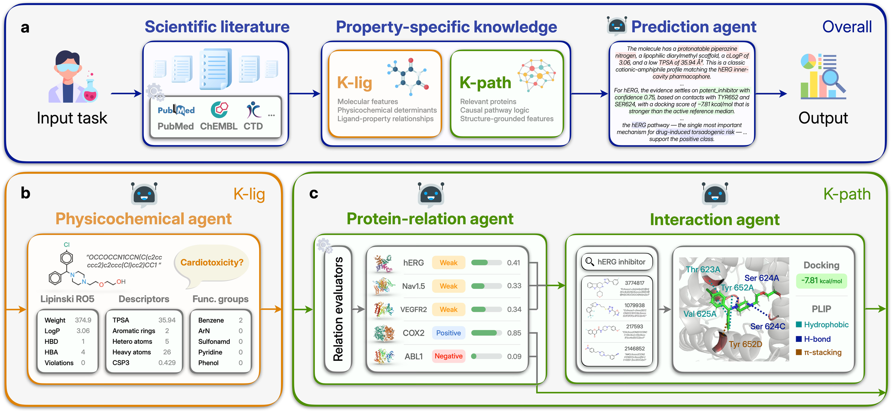

<h1 align="center">Pharmacological Mechanism-guided Collaborative LLM Agents for Molecular Property Prediction </h1>

## Overview
This repository introduces **PharmLens**, a **pharmacological mechanism-guided multi-agent framework** that predicts molecular properties from tool-measured evidence.  

<p align="center">
  
</p>


## Usage

Install dependencies, then create a `.env` file in the repository root holding the API key for your backbone:

```bash
pip install -r requirements.txt
echo "DEEPSEEK_API_KEY=your-api-key" > .env
```

Predict a single molecule:

```bash
python -m agent.scripts.predict_one \
  --smiles "OCCOCCN1CCN(C(c2ccccc2)c2ccc(Cl)cc2)CC1" --task hia
```

Run a benchmark task:

```bash
python -m agent.scripts.run_task --task hia --workers 8
```